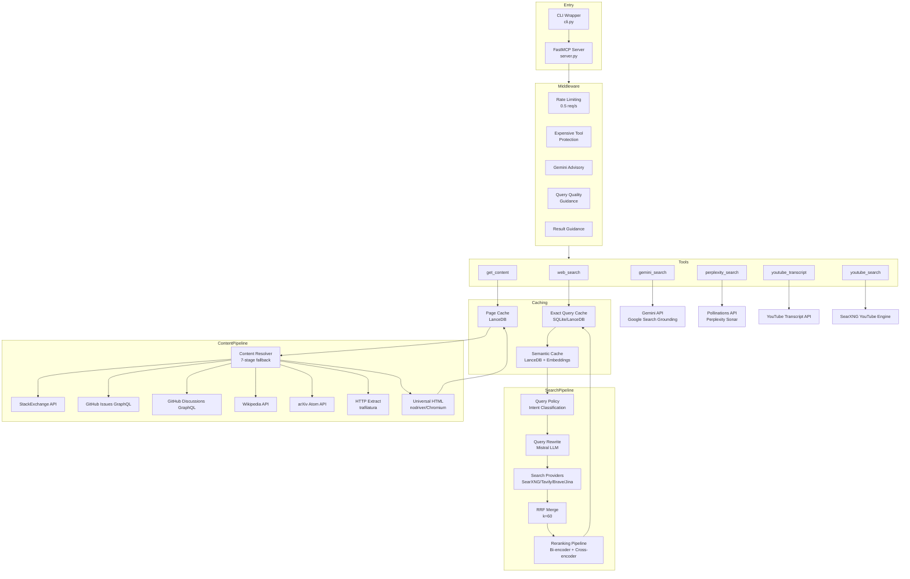

<!-- generated-by: gsd-doc-writer -->
# Architecture Overview

The Kindly Web Search MCP Server is a Model Context Protocol (MCP) server designed for AI coding assistants. It provides multi-provider web search with intelligent result merging, staged content extraction, and semantic caching for efficient, LLM-ready information retrieval.

## System Overview

The server exposes 6 MCP tools, 3 resources, and 3 prompts through the FastMCP framework. It operates as a stateless service with three-tier caching for performance optimization. The architecture follows a pipeline pattern: query processing → multi-provider search → RRF merge → reranking → lightweight result return. Content extraction is handled separately via staged fallback through specialized loaders.



## Core Components

### Entry Points

| Component | File | Purpose |
|-----------|------|---------|
| CLI Wrapper | `cli.py` | Provides `start-mcp-server` subcommand for MCP host integration |
| FastMCP Server | `server.py` | Registers tools, resources, prompts, and middleware |
| Main Orchestrator | `search/orchestrator.py` | Coordinates query rewrite → search → merge → rerank pipeline |

### Search Pipeline (`search/`)

| Module | Purpose |
|--------|---------|
| `orchestrator.py` | Main search pipeline coordination |
| `__init__.py` | Provider detection, circuit breaker, RRF merge, budget tracking |
| `searxng.py` | SearXNG metasearch provider (primary, self-hosted) |
| `tavily.py` | Tavily search API provider |
| `brave.py` | Brave Search API provider |
| `jina.py` | Jina AI search provider |
| `merge.py` | Reciprocal Rank Fusion implementation |
| `query_policy.py` | Intent classification and rewrite mode selection |
| `query_policy_resolver.py` | Resolves routing policy (local vs HF Space) |
| `query_rewrite.py` | Mistral-powered query expansion |
| `normalize.py` | Query normalization and URL canonicalization |
| `gemini_search_tool.py` | Gemini search MCP tool with Google Search grounding |
| `pollinations.py` | Perplexity Sonar via Pollinations API |
| `youtube.py` | YouTube search via SearXNG engine |

### Content Resolution (`content/`)

| Module | Purpose |
|--------|---------|
| `resolver.py` | 7-stage staged fallback pipeline coordinator |
| `stackexchange.py` | StackOverflow/StackExchange API (full thread extraction) |
| `github_issues.py` | GitHub Issues GraphQL API |
| `github_discussions.py` | GitHub Discussions GraphQL API |
| `wikipedia.py` | Wikipedia MediaWiki Action API |
| `arxiv.py` | arXiv Atom API + PDF to Markdown |
| `youtube.py` | YouTube transcript extraction via youtube-transcript-api |

### Scraping (`scrape/`)

| Module | Purpose |
|--------|---------|
| `universal_html.py` | Nodriver/Chromium headless browser for JS-heavy sites |
| `chromium_pool.py` | Pooled browser instances for reuse |
| `http_extract.py` | Trafilatura-based HTTP extraction (no browser) |
| `extract.py` | HTML to Markdown extraction logic |
| `sanitize.py` | Markdown sanitization and cleanup |

### Caching (`cache/`)

| Module | Purpose |
|--------|---------|
| `query_cache.py` | Exact query cache (deterministic key-based, LanceDB) |
| `semantic_cache.py` | Semantic similarity cache (embedding-based fuzzy match) |
| `page_cache.py` | URL to page content cache |
| `store.py` | LanceDB storage backend |
| `content_type.py` | Content type classification with adaptive TTL |
| `schema.py` | LanceDB table schemas |

### Embeddings & Reranking (`embeddings/`, `rerank/`)

| Module | Purpose |
|--------|---------|
| `embeddings/hf_space.py` | HF Space embedding service (jina-embeddings-v2-small-en) |
| `embeddings/rate_limiter.py` | Batch rate limiting for embedding calls |
| `rerank/core.py` | Multi-stage reranking pipeline orchestration |
| `rerank/bi_encoder.py` | Bi-encoder filtering stage |
| `rerank/hf_space_rerank.py` | Cross-encoder reranking via HF Space |
| `rerank/diversity.py` | Embedding-based diversity pruning |

### Middleware (`middleware/`)

| Module | Purpose |
|--------|---------|
| `expensive_tool_protection.py` | Blocks first perplexity_search call, returns steering message |
| `gemini_advisory.py` | Non-blocking query tips for gemini_search |
| `query_guidance.py` | Query quality tips and result extraction guidance |

### Models & Settings

| Module | Purpose |
|--------|---------|
| `models.py` | Pydantic models: `WebSearchResult`, `GetContentResponse`, `YouTubeTranscriptResponse` |
| `settings.py` | Environment-first configuration dataclass |

## Data Flow

### web_search Flow

```
1. Query received → Normalize query
2. Exact Query Cache lookup (L1, deterministic)
   ├─ Hit: Return cached results
   └─ Miss: Continue
3. Semantic Cache lookup (L2, embedding-based)
   ├─ Hit (similarity >= 0.82): Return cached results
   └─ Miss: Continue
4. Query Policy classification (intent + rewrite mode)
   ├─ bypass: Use original query
   ├─ light_rewrite: Single variant + original
   └─ decompose/multi_rewrite: Multiple complementary queries
5. Query Rewrite (Mistral LLM, optional)
   └─ Generate 2-3 complementary search queries
6. Multi-provider search (tiered)
   ├─ Tier 1: SearXNG (always fires)
   ├─ Tier 2: Tavily, Brave, Jina (concurrent with semaphore)
   └─ Circuit breaker + budget tracking per provider
7. RRF Merge (k=60)
   └─ Deduplicate by canonical URL, compute fused scores
8. Reranking pipeline (optional)
   ├─ Bi-encoder filtering (when candidates > top_k * 2)
   ├─ Cross-encoder reranking (HF Space)
   └─ Diversity pruning (threshold 0.85)
9. Cache write (L1 exact + L2 semantic)
10. Return lightweight results (title, link, snippet only)
```

### get_content Flow

```
1. URL received → Canonicalize URL
2. Page Cache lookup (L3)
   ├─ Hit: Return cached page_content
   └─ Miss: Continue
3. Content Resolver staged fallback:
   Stage 1: StackExchange API
     ├─ Match: Full thread (question + answers + comments)
     └─ No match: Continue
   Stage 2: GitHub Issues GraphQL
     ├─ Match: Issue + comments
     └─ No match: Continue
   Stage 3: GitHub Discussions GraphQL
     ├─ Match: Discussion + replies
     └─ No match: Continue
   Stage 4: Wikipedia API
     ├─ Match: Article content
     └─ No match: Continue
   Stage 5: arXiv Atom API
     ├─ Match: Paper metadata + PDF to Markdown
     └─ No match: Continue
   Stage 6: HTTP extraction (trafilatura)
     ├─ Success (>= 50 words): Return extracted content
     └─ Fail: Continue
   Stage 7: Universal HTML (nodriver/Chromium)
     ├─ JS-heavy sites, dynamic content
     └─ Skip obvious PDFs
4. Sanitize Markdown
5. Page Cache store (L3)
6. Return LLM-ready Markdown
```

## Search Provider Pipeline

### Provider Priority (3-Tier)

| Tier | Providers | Behavior |
|------|-----------|----------|
| Tier 1 | SearXNG | Always fires (primary, self-hosted, no API key cost) |
| Tier 2 | Tavily, Brave, Jina | Concurrent with semaphore (max 2 parallel) |
| Tier 3 | DuckDuckGo | Backup (not yet implemented) |

### Circuit Breaker

```python
@dataclass
class CircuitBreaker:
    failure_threshold: int = 3        # Open after N consecutive failures
    reset_timeout_seconds: float = 60.0  # Auto-reset after timeout
```

- Per-provider circuit breaker tracks failures
- Opens after 3 consecutive failures
- Auto-resets after 60 seconds
- Prevents cascading failures to unhealthy providers

### Provider Budget

```python
@dataclass
class ProviderBudget:
    max_calls_per_query: int = 3      # Limit calls per provider per query
    auto-demotion_threshold: float = 0.5  # >50% failure rate = demotion
```

- Tracks per-provider call counts
- Auto-demotes providers with >50% failure rate after 2+ calls
- Resets per query

### Reciprocal Rank Fusion (RRF)

```python
def rrf_merge(result_lists: list[list[WebSearchResult]], k: int = 60) -> list[WebSearchResult]:
    """Merge multiple ranked lists using RRF.
    Formula: score = Σ 1/(k + rank_i) for each list where result appears.
    """
```

- Standard RRF with k=60 (industry standard)
- Deduplicates by canonical URL
- Preserves provider attribution in result metadata

## Content Resolution Pipeline

### Staged Fallback Strategy

The resolver implements a 7-stage fallback pipeline optimized for LLM consumption:

| Stage | Handler | Source Type | Output Format |
|-------|---------|-------------|---------------|
| 1 | StackExchange API | StackOverflow, SE network | Full thread: Q + answers + comments |
| 2 | GitHub Issues GraphQL | GitHub issues | Issue body + all comments |
| 3 | GitHub Discussions GraphQL | GitHub discussions | Discussion + all replies |
| 4 | Wikipedia API | Wikipedia articles | Article content, cleaned |
| 5 | arXiv Atom API | Academic papers | Metadata + PDF → Markdown |
| 6 | HTTP extraction | Static HTML | Trafilatura extraction |
| 7 | Universal HTML | Dynamic/JS sites | Nodriver/Chromium rendering |

### URL Pattern Matching

Each specialized handler uses URL pattern detection:

```python
# StackExchange: matches *.stackexchange.com, stackoverflow.com, superuser.com, etc.
_ISSUE_RE = re.compile(r"/(?:questions|q)/(\d+)(?:/|$)")

# GitHub Issues: matches github.com/<owner>/<repo>/issues/<number>
_ISSUE_RE = re.compile(r"^/([^/]+)/([^/]+)/issues/(\d+)(?:/|$)")

# GitHub Discussions: matches github.com/<owner>/<repo>/discussions/<number>
_DISCUSSION_RE = re.compile(r"^/([^/]+)/([^/]+)/discussions/(\d+)(?:/|$)")

# Wikipedia: matches *.wikipedia.org/wiki/<title>
_WIKI_RE = re.compile(r"^/wiki/([^/]+)$")

# arXiv: matches arxiv.org/abs/<id> or arxiv.org/pdf/<id>
_ARXIV_RE = re.compile(r"^(?:/abs|/pdf)/(\d+\.\d+|[\w\-]+/\d+)(?:\.pdf)?$")
```

## Caching Strategy

### Three-Tier Cache Architecture

```
┌─────────────────────────────────────────────────────────────┐
│                    L1: Exact Query Cache                     │
│  ─────────────────────────────────────────────────────────── │
│  • Deterministic key: query|num_results|rewrite|mode         │
│  • SQLite/LanceDB backend                                    │
│  • TTL: 24 hours                                             │
│  • Fastest lookup: SHA256 key hash                           │
└─────────────────────────────────────────────────────────────┘
                           ↓ Miss
┌─────────────────────────────────────────────────────────────┐
│                   L2: Semantic Cache                         │
│  ─────────────────────────────────────────────────────────── │
│  • LanceDB vector store + full-text hybrid search            │
│  • Embedding similarity threshold: 0.82                      │
│  • Adaptive TTL by content type:                             │
│    - error/debugging: 1 hour                                 │
│    - docs/api: 6 hours                                       │
│    - general: 12 hours                                       │
│    - versioned/factual: 7 days                               │
└─────────────────────────────────────────────────────────────┘
                           ↓ Miss
┌─────────────────────────────────────────────────────────────┐
│                    L3: Page Cache                            │
│  ─────────────────────────────────────────────────────────── │
│  • URL → page_content mapping                                │
│  • LanceDB backend                                           │
│  • TTL: 7 days (content changes less frequently)             │
│  • Metadata: extraction_method, word_count                   │
└─────────────────────────────────────────────────────────────┘
```

### Adaptive TTL by Content Type

```python
ADAPTIVE_TTL_SECONDS = {
    ContentType.error_debugging: 3600,      # 1 hour - errors get fixed
    ContentType.docs_api: 21600,            # 6 hours - docs can update
    ContentType.general: 43200,             # 12 hours - general content
    ContentType.versioned_factual: 604800,  # 7 days - stable facts
}
```

### Semantic Cache Lookup

```python
async def get_semantic_cache(
    store: SemanticCacheStore,
    query: str,
    min_score: float = 0.82,  # Similarity threshold
    use_hybrid: bool = True,  # Vector + full-text search
) -> dict | None:
```

- Hybrid search combining vector similarity and full-text
- Filters by similarity threshold (default 0.82)
- Validates TTL based on content type classification

## Middleware Stack

### Middleware Order (per call)

```
1. Rate Limiting Middleware (FastMCP built-in)
   └─ 0.5 requests/second (1 request every 2 seconds)
   └─ Burst capacity: 3 requests

2. Expensive Tool Protection Middleware
   └─ Blocks first perplexity_search call
   └─ Returns steering message with query best practices
   └─ Forces agent to refine query before retry

3. Gemini Advisory Middleware (non-blocking)
   └─ Logs query quality tips for gemini_search
   └─ Call proceeds normally

4. Query Quality Middleware (non-blocking)
   └─ Logs query tips on EVERY web_search call
   └─ Tips: specific > vague, one topic, exact terms

5. Result Guidance Middleware (non-blocking)
   └─ Logs extraction guidance on EVERY web_search result
   └─ Guidance: extract facts, compare sources, state gaps
```

### Expensive Tool Protection Pattern

```python
# First call: raises ToolError with steering message
if block_first_attempt and attempt_count == 0:
    raise ToolError(QUERY_QUALITY_STEERING_MESSAGE)

# Second call: allows through
return await call_next(context)
```

This implements a "think first, then call expensive tool" pattern that forces the calling agent to analyze and improve their query before consuming expensive API resources.

## Tool Contracts

### 6 MCP Tools

| Tool | Purpose | Returns | Annotations |
|------|---------|---------|-------------|
| `web_search` | Multi-provider search | Lightweight results (title, link, snippet) | `readOnlyHint: true`, `idempotentHint: true`, `openWorldHint: true` |
| `get_content` | Single URL extraction | LLM-ready Markdown | `readOnlyHint: true`, `idempotentHint: true`, `openWorldHint: true` |
| `gemini_search` | AI-synthesized grounded answer | Answer with citations | `readOnlyHint: true`, `idempotentHint: true`, `openWorldHint: true` |
| `perplexity_search` | Deep reasoning synthesis | AI answer with sources | `readOnlyHint: true`, `idempotentHint: true`, `openWorldHint: true` |
| `youtube_transcript` | Video transcript extraction | Transcript text + metadata | `readOnlyHint: true`, `idempotentHint: true`, `openWorldHint: true` |
| `youtube_search` | YouTube video discovery | Video results list | `readOnlyHint: true`, `idempotentHint: true`, `openWorldHint: true` |

### Tool Separation Philosophy

The tool contracts follow a intentional separation pattern:

- **Search discovers** → `web_search` returns lightweight results
- **Fetch extracts** → `get_content` returns LLM-ready Markdown for a single URL
- **AI search synthesizes** → `gemini_search`/`perplexity_search` return grounded answers

This separation prevents context bloat and allows the agent to selectively fetch only relevant sources.

### web_search Parameters

```python
@mcp.tool(
    annotations=ToolAnnotations(
        title="Web Search",
        readOnlyHint=True,
        idempotentHint=True,
        openWorldHint=True,
    )
)
async def web_search(
    query: str,
    num_results: int = 3,      # Recommended range 1-5
    rewrite: bool = True,      # Enable query rewriting
    ctx: Context = CurrentContext(),
) -> dict:
```

### get_content Parameters

```python
@mcp.tool(
    annotations=ToolAnnotations(
        title="Get Content",
        readOnlyHint=True,
        idempotentHint=True,
        openWorldHint=True,
    )
)
async def get_content(
    url: str,
    char_offset: int = 0,
    char_length: int = 20_000,
    summary_mode: str = "none",
    focus_query: str | None = None,
    ctx: Context = CurrentContext(),
) -> dict:
```

Response fields use explicit fetch vocabulary:

- `input_url`: exact caller-provided URL.
- `normalized_url`: normalized URL used for cache lookup and batch deduplication.
- `fetched_url`: actual URL reached after redirects, or `null` when no network fetch reached a URL.
- `source_type`: detected source family, such as `html`, `pdf`, `github_issue`, or `wikipedia`.
- `fetch_backend`: backend strategy used, such as `safe_http_extract`, `jina_reader`, or `browser_fallback`.
- `window`: pagination metadata with `offset`, `length`, `total_chars`, `has_more`, and `next_offset`.

## Resources and Prompts

### 3 MCP Resources

| Resource | URI | Purpose |
|----------|-----|---------|
| Provider Status | `status://providers` | Shows configured search providers |
| Feature Status | `status://features` | Shows enabled features and cache settings |
| Workflow Doc | `docs://workflow` | Recommended workflow for tool usage |

### 3 MCP Prompts

| Prompt | Purpose | Template |
|--------|---------|----------|
| `debug_error_prompt` | Debug error using web search | "Debug this error: {error_message}" |
| `research_topic_prompt` | Research a topic | "Research: {topic} (depth: {depth})" |
| `find_library_docs_prompt` | Find library documentation | "Find docs for: {library} - {feature}" |

## Directory Structure

```
src/kindly_web_search_mcp_server/
├── __init__.py              # Package exports
├── __main__.py              # Entry point for uvx
├── cli.py                   # CLI wrapper (start-mcp-server)
├── server.py                # FastMCP server registration
├── models.py                # Pydantic response models
├── settings.py              # Environment-first configuration
│
├── search/                  # Search pipeline
│   ├── __init__.py          # Provider detection, RRF, circuit breaker
│   ├── orchestrator.py      # Main pipeline coordination
│   ├── searxng.py           # SearXNG provider
│   ├── tavily.py            # Tavily provider
│   ├── brave.py             # Brave provider
│   ├── jina.py              # Jina provider
│   ├── merge.py             # RRF merge implementation
│   ├── query_policy.py      # Intent classification
│   ├── query_policy_resolver.py  # Policy routing
│   ├── query_rewrite.py     # Mistral query expansion
│   ├── normalize.py         # Query/URL normalization
│   ├── gemini_search_tool.py  # Gemini search MCP tool
│   ├── pollinations.py      # Perplexity Sonar
│   └── youtube.py           # YouTube search
│
├── content/                 # Content resolution
│   ├── resolver.py          # 7-stage fallback coordinator
│   ├── stackexchange.py     # StackOverflow/SE API
│   ├── github_issues.py     # GitHub Issues GraphQL
│   ├── github_discussions.py # GitHub Discussions GraphQL
│   ├── wikipedia.py         # Wikipedia API
│   ├── arxiv.py             # arXiv API
│   └── youtube.py           # YouTube transcript
│
├── scrape/                  # Scraping utilities
│   ├── universal_html.py    # Nodriver/Chromium loader
│   ├── chromium_pool.py     # Browser instance pooling
│   ├── http_extract.py      # Trafilatura extraction
│   ├── extract.py           # HTML → Markdown
│   ├── sanitize.py          # Markdown cleanup
│   ├── fetch.py             # HTTP fetch helpers
│   └── nodriver_worker.py   # Browser subprocess worker
│
├── cache/                   # Caching layers
│   ├── query_cache.py       # Exact query cache
│   ├── semantic_cache.py    # Semantic similarity cache
│   ├── page_cache.py        # URL → content cache
│   ├── store.py             # LanceDB backend
│   ├── content_type.py      # Content classification
│   └── schema.py            # Table schemas
│
├── embeddings/              # Embedding services
│   ├── hf_space.py          # HF Space embedding client
│   └── rate_limiter.py      # Batch rate limiting
│
├── rerank/                  # Reranking pipeline
│   ├── core.py              # Pipeline orchestration
│   ├── bi_encoder.py        # Bi-encoder filtering
│   ├── hf_space_rerank.py   # Cross-encoder reranking
│   └── diversity.py         # Diversity pruning
│
├── middleware/              # FastMCP middleware
│   ├── expensive_tool_protection.py  # perplexity_search blocking
│   ├── gemini_advisory.py   # gemini_search advisory
│   └── query_guidance.py    # Query quality tips
│
└── utils/                   # Utilities
    ├── diagnostics.py       # Diagnostic logging
    └── logging.py           # Logging configuration
```

## Key Abstractions

### WebSearchResult Model

```python
class WebSearchResult(BaseModel):
    title: str                    # Human-readable title
    link: str                     # Canonical URL
    snippet: str                  # Search engine snippet
    domain: str | None            # Extracted domain
    resource_type: str | None     # web, pdf, youtube, github, etc.
    mime_hint: str | None         # MIME type hint
    providers: list[str] | None   # Providers that surfaced this
    score: float | None           # RRF/reranked score
    diagnostics: list[dict] | None  # Debug metadata
```

### RewritePolicy Model

```python
class RewritePolicy(BaseModel):
    mode: RewriteMode  # "bypass" | "light_rewrite" | "multi_rewrite" | "decompose"
    reason: str        # Human-readable explanation
    must_keep_terms: list[str]  # Exact tokens to preserve
    include_original: bool      # Include original query in variants
```

### QueryRewritePlan Model

```python
class QueryRewritePlan(BaseModel):
    original_query: str
    intent: str           # Classified intent
    policy: RewritePolicy
    variants: list[QueryVariant]  # Complementary queries
    final_queries: list[str]      # Deduplicated, limited queries
```

## Environment Configuration

All configuration is environment-first via `settings.py`. Key variables:

| Variable | Purpose | Default |
|----------|---------|---------|
| `SEARXNG_BASE_URL` | Primary search provider | Required (or other provider) |
| `TAVILY_API_KEY` | Tavily provider | Optional |
| `BRAVE_API_KEY` | Brave provider | Optional |
| `JINA_API_KEY` | Jina provider | Optional |
| `GITHUB_TOKEN` | GitHub GraphQL API access | Recommended |
| `MISTRAL_API_KEY` | Query rewriting | Optional |
| `KINDLY_GEMINI_API_KEY` | Gemini grounding | Optional |
| `POLLINATIONS_API_KEY` | Perplexity Sonar | Optional |
| `KINDLY_SEMANTIC_CACHE_ENABLED` | Semantic cache toggle | `true` |
| `KINDLY_RERANKING_ENABLED` | Reranking toggle | `true` |
| `KINDLY_QUERY_REWRITE_ENABLED` | Query rewrite toggle | `true` |
| `KINDLY_LANCEDB_DIR` | LanceDB storage path | `./lancedb_data` |
| `KINDLY_BROWSER_EXECUTABLE_PATH` | Chrome/Chromium path | Auto-detected |

<!-- VERIFY: External service URLs like HF Space endpoints are configurable via environment variables and may change -->
<!-- VERIFY: Rate limit values (0.5 req/s) are defaults and can be tuned via FastMCP configuration -->

## Design Patterns

### Staged Fallback Pattern

Content resolution uses staged fallback for resilience:

```python
async def resolve_page_content_markdown(url: str) -> str | None:
    # Stage 1: Try specialized API
    try:
        parse_stackexchange_url(url)
        return await fetch_stackexchange_thread_markdown(url)
    except StackExchangeError:
        pass  # Not a StackExchange URL, continue

    # Stage 2: Try next specialized API
    # ... similar pattern for GitHub, Wikipedia, arXiv

    # Stage 6: HTTP extraction (no browser)
    result = await http_extract(url, timeout=15.0)
    if result.word_count >= 50:
        return result.text

    # Stage 7: Universal HTML (browser fallback)
    return await load_url_as_markdown(url)
```

### Circuit Breaker Pattern

Provider calls use circuit breaker for fault tolerance:

```python
if _circuit_breaker.is_open(provider_name):
    return []  # Skip unhealthy provider

try:
    results = await provider_fn(query, num_results, http_client)
    _circuit_breaker.record_success(provider_name)
    return results
except Exception:
    _circuit_breaker.record_failure(provider_name)
    return []
```

### Middleware Chain Pattern

FastMCP middleware is stacked for layered processing:

```python
mcp.add_middleware(RateLimitingMiddleware(...))
mcp.add_middleware(create_expensive_tool_middleware())
mcp.add_middleware(create_gemini_advisory_middleware())
mcp.add_middleware(create_query_quality_middleware())
mcp.add_middleware(create_result_guidance_middleware())
```

Each middleware intercepts calls in order, with blocking middleware raising `ToolError` and advisory middleware logging tips.
