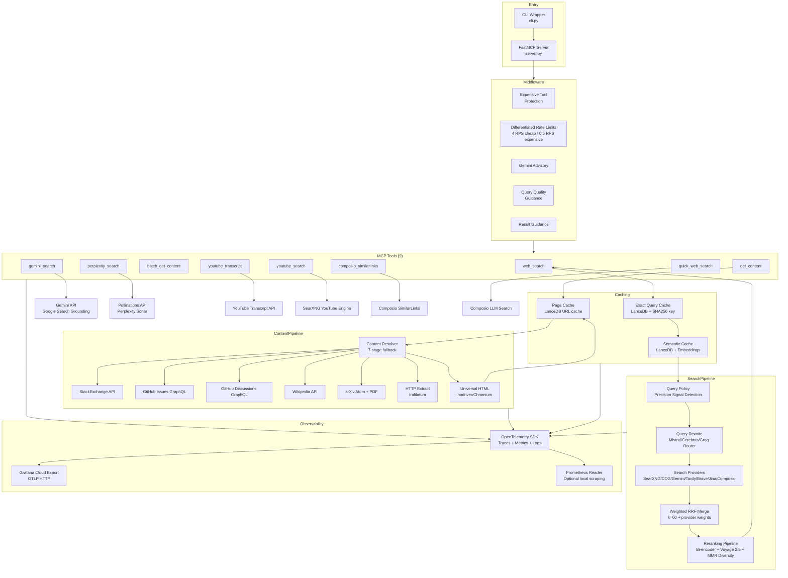

<!-- generated-by: gsd-doc-writer -->
# Architecture Overview

The Kindly Web Search MCP Server is a Model Context Protocol (MCP) server designed for AI coding assistants. It provides multi-provider web search with weighted RRF merge, staged content extraction, semantic caching, and comprehensive OpenTelemetry observability for LLM-ready information retrieval.

## System Overview

The server exposes **9 MCP tools**, **3 resources**, and **3 prompts** through the FastMCP framework. It operates as a stateless service with three-tier caching for performance optimization. The architecture follows a pipeline pattern: query policy classification → provider-aware query rewrite → multi-provider search → weighted RRF merge → reranking → lightweight result return. Content extraction is handled separately via staged fallback through specialized loaders.



## MCP Tools

The server provides **9 MCP tools** with differentiated purposes:

| Tool | Purpose | Returns | Rate Class |
|------|---------|---------|------------|
| `web_search` | Multi-provider URL discovery | Lightweight results (title, link, snippet) | Cheap (4 RPS) |
| `get_content` | Single URL extraction | LLM-ready Markdown with windowing | Cheap (4 RPS) |
| `batch_get_content` | Multi-URL extraction with budget/cursor | Bounded batch results with continuation | Cheap (4 RPS) |
| `gemini_search` | AI-synthesized grounded answer | Answer with [N] citations | Cheap (4 RPS) |
| `perplexity_search` | Deep reasoning synthesis | AI answer with sources | Expensive (0.5 RPS) |
| `youtube_transcript` | Video transcript extraction | Transcript text + metadata | Cheap (4 RPS) |
| `youtube_search` | YouTube video discovery | Video results via SearXNG | Cheap (4 RPS) |
| `composio_similarlinks` | Find related URLs from known URL | Similar links with scores | Cheap (4 RPS) |
| `quick_web_search` | Composio/Exa synthesized answer | Answer with citations | Cheap (4 RPS) |

### Tool Separation Philosophy

The tool contracts follow intentional separation:

- **Search discovers** → `web_search` returns lightweight results
- **Fetch extracts** → `get_content`/`batch_get_content` return LLM-ready Markdown
- **AI search synthesizes** → `gemini_search`/`perplexity_search`/`quick_web_search` return grounded answers

This separation prevents context bloat and allows selective fetching of relevant sources.

### web_search Parameters

```python
@mcp.tool(annotations=ToolAnnotations(
    title="Web Search",
    readOnlyHint=True,
    idempotentHint=True,
    openWorldHint=True,
))
async def web_search(
    query: str,
    research_goal: str,          # REQUIRED: describes search intent
    num_results: int = 5,        # Range 1-10, max capped
    rewrite: bool = True,        # Enable query rewriting
    providers: list[str] | None = None,  # Override provider selection
) -> dict:
```

### get_content Parameters

```python
@mcp.tool(...)
async def get_content(
    url: str,
    char_offset: int = 0,        # Pagination offset
    char_length: int = 20_000,   # Window size (max 50K)
    summary_mode: str = "none",  # "none", "brief", "detailed"
    focus_query: str | None = None,  # Summary focus
) -> dict:
```

Response fields use explicit fetch vocabulary: `input_url`, `normalized_url`, `fetched_url`, `source_type`, `fetch_backend`, `window` (with `has_more`, `next_offset`).

### batch_get_content Parameters

```python
@mcp.tool(...)
async def batch_get_content(
    urls: list[str],
    max_concurrency: int = 4,    # Parallel fetch limit (max 8)
    per_item_char_length: int = 8_000,
    total_char_budget: int = 120_000,  # Max chars returned
    cursor: str | None = None,   # Continuation from prior response
) -> dict:
```

Returns `has_more` and `cursor` for pagination across multiple calls.

## Search Pipeline

### Flow Diagram

```
1. Query received → Normalize query (lowercase, trim)
2. Exact Query Cache lookup (L1, deterministic SHA256 key)
   ├─ Hit: Return cached results
   └─ Miss: Continue
3. Semantic Cache lookup (L2, embedding similarity >= 0.92)
   ├─ Hit: Return cached results
   └─ Miss: Continue
4. Query Policy classification (precision signal detection)
   ├─ bypass: Preserve original query (error codes, URLs, versions)
   └─ expand: Generate complementary queries via LLM
5. Query Rewrite (multi-provider LLM router + FunctionGemma classifier)
   └─ FunctionGemma intent/decomposition + Mistral/Cerebras/Groq rewrite
   └─ Provider-aware: keyword-targeted vs neural-targeted variants
6. Multi-provider search (tiered, circuit-breaker protected)
   ├─ Tier 1: SearXNG + DDG + Gemini + Composio (ALWAYS mode, free/paid)
   ├─ Tier 2: Tavily, Brave, Jina (CONDITIONAL mode, caller-requested)
   └─ Per-provider circuit breaker + budget tracking
7. Weighted RRF Merge (k=60)
   └─ Provider weights: tavily=1.3, gemini=1.2, composio=1.15, jina=1.1
   └─ Host-cap deduplication (max 2 per host in top-k)
8. Reranking pipeline (optional, when candidates > top_k)
   ├─ Bi-encoder filtering (HF Inference embeddings)
   ├─ Voyage reranker 2.5 (primary cross-encoder)
   ├─ Jina reranker v3 (fallback cross-encoder)
   └─ MMR diversity pruning (threshold 0.85)
9. Cache write (L1 exact + L2 semantic, fire-and-forget)
10. Return lightweight results (title, link, snippet, provider_count)
```

### Provider Modes

| Mode | Behavior | Examples |
|------|----------|----------|
| `ALWAYS` | Fires on every search (configured) | SearXNG, DDG, Gemini, Composio |
| `CONDITIONAL` | Only when caller requests via `providers` param | Jina |
| `NEVER` | Disabled even if API key present | Tavily, Brave (default) |

Configured via `KINDLY_*_MODE` environment variables.

### Circuit Breaker

```python
@dataclass
class CircuitBreaker:
    failure_threshold: int = 3        # Open after N consecutive failures
    reset_timeout_seconds: float = 60.0  # Auto-reset after timeout
```

- Per-provider circuit breaker tracks failures
- Opens after 3 consecutive failures
- Auto-resets after 60 seconds (half-open state)
- Telemetry: `record_circuit_breaker_state`, `record_circuit_breaker_event`

### Provider Budget

```python
@dataclass
class ProviderBudget:
    max_calls_per_query: int = 3      # Limit calls per provider per query
    auto_demotion_threshold: float = 0.5  # >50% failure rate = demotion
```

- Tracks per-provider call counts
- Auto-demotes providers with >50% failure rate after 2+ calls
- Resets per query

### Weighted Reciprocal Rank Fusion (RRF)

```python
def merge_search_results(
    result_lists: list[list[WebSearchResult]],
    *,
    k: int = 60,  # RRF constant
    provider_weights: dict[str, float] = {
        "searxng": 1.0,
        "ddg": 0.7,
        "tavily": 1.3,   # Optimized for AI assistants
        "brave": 1.0,
        "jina": 1.1,     # Semantic search expertise
        "gemini": 1.2,   # Google grounding
        "composio_llm_search": 1.15,  # LLM-enhanced ranking
    },
    max_per_host: int = 2,  # Host diversity cap
) -> list[WebSearchResult]:
```

Formula: `score += w_provider × 1/(k + rank)`

- Deduplicates by canonical URL
- Host-cap prevents domain clustering (max 2 per host in top-k)
- Preserves provider attribution (`providers`, `provider_count` fields)

## Content Resolution Pipeline

### 7-Stage Staged Fallback

| Stage | Handler | Source Type | Extraction Method |
|-------|---------|-------------|-------------------|
| 1 | StackExchange API | StackOverflow, SE network | API (full thread) |
| 2 | GitHub Issues GraphQL | GitHub issues | GraphQL |
| 3 | GitHub Discussions GraphQL | GitHub discussions | GraphQL |
| 4 | Wikipedia API | Wikipedia articles | MediaWiki Action API |
| 5 | arXiv Atom API | Academic papers | Atom + PDF → Markdown |
| 6 | HTTP extraction | Static HTML | trafilatura (no browser) |
| 7 | Universal HTML | Dynamic/JS sites | nodriver/Chromium |

### URL Pattern Matching

```python
# StackExchange: *.stackexchange.com, stackoverflow.com, superuser.com
_ISSUE_RE = re.compile(r"/(?:questions|q)/(\d+)(?:/|$)")

# GitHub Issues: github.com/<owner>/<repo>/issues/<number>
_ISSUE_RE = re.compile(r"^/([^/]+)/([^/]+)/issues/(\d+)(?:/|$)")

# GitHub Discussions: github.com/<owner>/<repo>/discussions/<number>
_DISCUSSION_RE = re.compile(r"^/([^/]+)/([^/]+)/discussions/(\d+)(?:/|$)")

# Wikipedia: *.wikipedia.org/wiki/<title>
_WIKI_RE = re.compile(r"^/wiki/([^/]+)$")

# arXiv: arxiv.org/abs/<id> or arxiv.org/pdf/<id>
_ARXIV_RE = re.compile(r"^(?:/abs|/pdf)/(\d+\.\d+|[\w\-]+/\d+)(?:\.pdf)?$")
```

### Fallback Logic

- Stages 1-5: Return error note on failure (API-specific)
- Stages 2-4: Fallback to browser on GraphQL failure (token missing, rate-limit)
- Stage 6: Requires >= 50 words for success
- Stage 7: Browser fallback for JS-heavy sites, skips PDFs

## Caching Strategy

### Three-Tier Architecture

```
┌─────────────────────────────────────────────────────────────┐
│                    L1: Exact Query Cache                     │
│  ─────────────────────────────────────────────────────────── │
│  • LanceDB backend + SHA256 composite key                    │
│  • Key: query|num_results|rewrite|mode|providers_key         │
│  • TTL: 24 hours                                             │
│  • Fastest lookup: deterministic hash match                  │
└─────────────────────────────────────────────────────────────┘
                           ↓ Miss
┌─────────────────────────────────────────────────────────────┐
│                   L2: Semantic Cache                         │
│  ─────────────────────────────────────────────────────────── │
│  • LanceDB vector store + hybrid search                      │
│  • Embedding: granite-embedding-97m-multilingual (384 dim)   │
│  • Similarity threshold: 0.92 (configurable)                 │
│  • Adaptive TTL by content type                              │
└─────────────────────────────────────────────────────────────┘
                           ↓ Miss
┌─────────────────────────────────────────────────────────────┐
│                    L3: Page Cache                            │
│  ─────────────────────────────────────────────────────────── │
│  • URL → page_content mapping                                │
│  • LanceDB backend                                           │
│  • TTL: 7 days (content changes less frequently)             │
│  • Metadata: extraction_method, word_count                   │
└─────────────────────────────────────────────────────────────┘
```

### Adaptive TTL by Content Type

```python
ADAPTIVE_TTL_SECONDS = {
    ContentType.error_debugging: 3600,      # 1 hour - errors get fixed
    ContentType.docs_api: 21600,            # 6 hours - docs can update
    ContentType.general: 43200,             # 12 hours - general content
    ContentType.versioned_factual: 604800,  # 7 days - stable facts
}
```

### SingleFlight Pattern

Request coalescing for concurrent identical searches:

```python
_search_flight = SingleFlight()
response = await _search_flight.do(flight_key, _execute_search)
```

Multiple concurrent requests for the same query share a single execution.

## Query Rewrite

### Simplified Mode: Bypass vs Expand

```python
RewriteMode = Literal["bypass", "expand"]

class RewritePolicy(BaseModel):
    mode: RewriteMode
    reason: str
    must_keep_terms: list[str]  # Exact literals to preserve
```

**No intent classification** — just precision signal detection.

### Precision Signals → Bypass

```python
_PRECISION_PATTERNS = (
    re.compile(r"https?://"),           # URLs
    re.compile(r'["`][^"`]{4,}["`]'),   # Quoted strings
    re.compile(r"\b[A-Za-z0-9_.-]+/[A-Za-z0-9_.-]+\b"),  # Repo names
    re.compile(r"\b\d+(?:\.\d+){1,3}\b"),  # Versions (1.2.3)
    re.compile(r"0x[0-9A-Fa-f]{4,8}"),  # Hex codes
    re.compile(r"E[A-Z]+[0-9]+"),       # Error codes (EINVAL)
    re.compile(r"--[A-Za-z0-9_-]+"),    # CLI flags
    re.compile(r"[0-9a-fA-F]{8}-[0-9a-fA-F]{4}-..."),  # UUIDs
    re.compile(r"\b[0-9a-fA-F]{7,40}\b"),  # Git hashes
)
```

Search operators (`site:`, `filetype:`, `inurl:`, etc.) also trigger bypass.

### Multi-Provider LLM Router

```python
# Free-tier load distribution across providers
CEREBRAS_API_KEY, GROQ_API_KEY, MISTRAL_API_KEY

# Intent-specific temperatures
TEMPERATURE_BY_INTENT = {
    "code": 0.15,           # Deterministic for technical queries
    "general_research": 0.5, # Balanced creativity
    "comparison": 0.3,       # Structured for entity comparisons
}
```

Provider-aware routing generates keyword-targeted and neural-targeted variants based on active providers.

## Reranking Pipeline

### Three-Stage Pipeline

```python
async def rerank_results(
    query: str,
    candidates: list[WebSearchResult],
    top_k: int = 10,
) -> list[WebSearchResult]:
```

1. **Bi-encoder filtering**: Embedding similarity filter when candidates > top_k × 2
2. **Voyage rerank-2.5**: Primary cross-encoder relevance scoring, with Jina fallback when configured
3. **MMR diversity**: Maximal Marginal Relevance with host diversity

### MMR Diversity Pruning

```python
diversified_rank = maximal_marginal_relevance_rank(
    query_embedding,
    embeddings,
    scoped_urls,
    lambda_param=settings.mmr_lambda_param,  # 0.5 by default
    max_per_host=2,
)
```

## Embeddings

### HF Inference Provider

```python
hf_embedding_model: str = "ibm-granite/granite-embedding-97m-multilingual-r2"
embedding_dim: int = 384
```

Used for:
- Semantic cache similarity scoring
- Bi-encoder reranking filter
- MMR diversity pruning

## Middleware Stack

### Order (per call)

1. **Expensive Tool Protection**: Blocks first `perplexity_search` call, returns steering message
2. **Differentiated Rate Limits**: 4 RPS for cheap tools, 0.5 RPS for expensive
3. **Gemini Advisory**: Non-blocking query quality tips for `gemini_search`
4. **Query Quality Middleware**: Tips on every `web_search` call
5. **Result Guidance Middleware**: Extraction guidance on every `web_search` result

### Rate Limit Configuration

```python
rate_limit_cheap_rps: float = 4.0      # web_search, get_content, gemini_search
rate_limit_cheap_burst: int = 12
rate_limit_expensive_rps: float = 0.5  # perplexity_search
rate_limit_expensive_burst: int = 1
```

## Observability

### OpenTelemetry Integration

Comprehensive telemetry following:
- OTEL HTTP Semantic Conventions
- OTEL MCP Semantic Conventions (emerging standard)
- Grafana Cloud Application Observability best practices

```python
init_telemetry(
    service_name="web-search-mcp",
    service_version="0.1.8",
)
```

Environment variables:
- `OTEL_EXPORTER_OTLP_ENDPOINT`: Grafana Cloud OTLP gateway
- `OTEL_EXPORTER_OTLP_HEADERS`: Authorization header
- `KINDLY_PROMETHEUS_PORT`: Optional Prometheus endpoint for Alloy scraping

### Three-Layer Observability Model

| Layer | Scope | Metrics |
|-------|-------|---------|
| Transport | JSON-RPC health, MCP session | Message latency |
| Tool Execution | Provider calls, cache, RRF, content | Per-stage duration, counts |
| Agentic | Task success, self-correction | Query length, domain diversity |

### Key Metrics

- **Provider**: `web_search_provider_calls_total`, `web_search_provider_duration_seconds`
- **Search**: `web_search_requests_total`, `web_search_duration_seconds`
- **Cache**: `web_search_cache_requests_total`, `web_search_semantic_cache_score_distribution`
- **RRF**: `web_search_rrf_merge_total`, `web_search_rrf_score_distribution`
- **Rerank**: `web_search_rerank_total`, `web_search_rerank_scores`
- **Circuit**: `web_search_provider_circuit_state`, `web_search_provider_circuit_events`
- **Query Quality**: `web_search_query_length_chars`, `web_search_domain_diversity`

### HTTPX Auto-Instrumentation

All HTTP client calls automatically traced with OTEL semantic conventions.

## Key Abstractions

### WebSearchResult Model

```python
class WebSearchResult(BaseModel):
    title: str
    link: str                      # Canonical URL
    snippet: str
    domain: str | None
    resource_type: str | None      # web, pdf, youtube, github
    mime_hint: str | None
    providers: list[str] | None    # Providers that surfaced this
    provider_count: int | None     # Agreement signal
    score: float | None            # RRF/reranked score
```

### RewritePolicy Model

```python
class RewritePolicy(BaseModel):
    mode: RewriteMode  # "bypass" | "expand"
    reason: str
    must_keep_terms: list[str]  # Exact literals to preserve
```

### QueryRewritePlan Model

```python
class QueryRewritePlan(BaseModel):
    original_query: str
    policy: RewritePolicy
    variants: list[QueryVariant]
    final_queries: list[str]  # Deduplicated, limited queries
```

## Directory Structure

```
src/kindly_web_search_mcp_server/
├── __init__.py              # Package exports
├── __main__.py              # Entry point for uvx
├── cli.py                   # CLI wrapper (start-mcp-server)
├── server.py                # FastMCP server registration
├── models.py                # Pydantic response models
├── settings.py              # Environment-first configuration
├── errors.py                # Error classification
├── telemetry.py             # OpenTelemetry instrumentation
│
├── search/                  # Search pipeline
│   ├── __init__.py          # Provider registry, circuit breaker, budget
│   ├── orchestrator.py      # Main pipeline coordination
│   ├── provider_config.py   # Provider mode configuration
│   ├── searxng.py           # SearXNG provider
│   ├── ddg.py               # DuckDuckGo provider
│   ├── tavily.py            # Tavily provider
│   ├── brave.py             # Brave provider
│   ├── jina.py              # Jina provider
│   ├── gemini_pollinations.py  # Gemini via Pollinations
│   ├── composio_llm_search.py  # Composio LLM search
│   ├── pollinations.py      # Perplexity Sonar
│   ├── youtube.py           # YouTube search
│   ├── merge.py             # Weighted RRF implementation
│   ├── query_policy.py      # Precision signal detection
│   ├── query_policy_resolver.py  # Policy routing (local vs heuristic)
│   ├── query_classifier_client.py # FunctionGemma classifier/decomposition client
│   ├── query_rewrite.py     # Multi-provider LLM rewrite
│   ├── query_rewrite_router.py  # LiteLLM Router for query rewrite
│   ├── query_rewrite_models.py  # Query variant models
│   ├── query_rewrite_prompts.py # Provider-aware prompts
│   ├── query_rewrite_validate.py # Variant validation
│   ├── gemini_search_tool.py # Gemini grounding MCP tool
│   └── normalize.py         # Query/URL normalization
│
├── content/                 # Content resolution
│   ├── resolver.py          # 7-stage fallback coordinator
│   ├── batch_orchestrator.py # Batch fetch orchestration
│   ├── fetch_pipeline.py    # Single URL fetch pipeline
│   ├── windowing.py         # Content windowing/slicing
│   ├── summary.py           # Optional summarization
│   ├── stackexchange.py     # StackOverflow/SE API
│   ├── github_issues.py     # GitHub Issues GraphQL
│   ├── github_discussions.py # GitHub Discussions GraphQL
│   ├── wikipedia.py         # Wikipedia API
│   ├── arxiv.py             # arXiv API
│   └── youtube.py           # YouTube transcript
│
├── scrape/                  # Scraping utilities
│   ├── universal_html.py    # Nodriver/Chromium loader
│   ├── chromium_pool.py     # Browser instance pooling
│   ├── http_extract.py      # Trafilatura extraction
│   ├── extract.py           # HTML → Markdown
│   ├── sanitize.py          # Markdown cleanup
│   ├── fetch.py             # HTTP fetch helpers
│   └── nodriver_worker.py   # Browser subprocess
│
├── cache/                   # Caching layers
│   ├── query_cache.py       # Exact query cache (L1)
│   ├── semantic_cache.py    # Semantic similarity (L2)
│   ├── page_cache.py        # URL → content (L3)
│   ├── store.py             # LanceDB backend
│   ├── content_type.py      # Content classification
│   └── schema.py            # Table schemas
│
├── embeddings/              # Embedding services
│   ├── hf_inference.py      # HF Inference Provider client
│   └── rate_limiter.py      # Batch rate limiting
│
├── rerank/                  # Reranking pipeline
│   ├── core.py              # Pipeline orchestration
│   ├── bi_encoder.py        # Bi-encoder filtering
│   ├── voyage.py            # Voyage reranker 2.5
│   ├── jina.py              # Jina fallback reranker
│   └── diversity.py         # MMR diversity pruning
│
├── middleware/              # FastMCP middleware
│   ├── expensive_tool_protection.py  # perplexity blocking
│   ├── rate_limits.py       # Differentiated rate limiting
│   ├── gemini_advisory.py   # gemini_search advisory
│   └── query_guidance.py    # Query quality tips
│
├── composio_tools.py        # Composio tool registration
│
└── utils/                   # Utilities
    ├── diagnostics.py       # Diagnostic logging
    ├── logging.py           # Logging configuration
    ├── observability.py     # Event emission helpers
    ├── singleflight.py      # Request coalescing
    └── structured_logging.py # Structured JSON logging
```

## Environment Configuration

All configuration is environment-first via `settings.py`. See [CONFIGURATION.md](./CONFIGURATION.md) for complete reference.

### Key Variables

| Variable | Purpose | Default |
|----------|---------|---------|
| `SEARXNG_BASE_URL` | Primary search provider | Required (or other provider) |
| `MISTRAL_API_KEY` | Query rewrite (primary) | Optional |
| `CEREBRAS_API_KEY` | Query rewrite (fallback) | Optional |
| `GROQ_API_KEY` | Query rewrite (fallback) | Optional |
| `GITHUB_TOKEN` | GitHub GraphQL API | Recommended |
| `KINDLY_GEMINI_API_KEY` | Gemini grounding | Optional |
| `POLLINATIONS_API_KEY` | Perplexity Sonar | Optional |
| `COMPOSIO_API_KEY` + `KINDLY_COMPOSIO_USER_ID` | Composio search | Optional |
| `KINDLY_SEMANTIC_CACHE_ENABLED` | Semantic cache toggle | `true` |
| `KINDLY_SEMANTIC_CACHE_MIN_SCORE` | Similarity threshold | `0.92` |
| `KINDLY_RERANKING_ENABLED` | Reranking toggle | `true` |
| `KINDLY_RERANK_PROVIDER` | Primary reranker provider | `voyage` |
| `KINDLY_VOYAGE_RERANK_MODEL` | Voyage reranker model | `rerank-2.5` |
| `KINDLY_ANALYTICS_ENABLED` | DuckDB analytics event capture | `true` |
| `KINDLY_QUERY_REWRITE_ENABLED` | Query rewrite toggle | `true` |
| `KINDLY_LANCEDB_DIR` | LanceDB storage path | `./lancedb_data` |

<!-- VERIFY: External service URLs like Grafana Cloud OTLP endpoints are configured via environment variables -->
<!-- VERIFY: Rate limit values are defaults from settings.py and can be overridden via KINDLY_RATE_LIMIT_* env vars -->

## Design Patterns

### Staged Fallback Pattern

Content resolution uses staged fallback for resilience:

```python
async def resolve_page_content_markdown(url: str) -> str | None:
    # Stage 1: Try specialized API
    try:
        parse_stackexchange_url(url)
        return await fetch_stackexchange_thread_markdown(url)
    except StackExchangeError:
        pass  # Not a StackExchange URL, continue

    # Stage 2-N: Similar pattern for GitHub, Wikipedia, arXiv...

    # Stage 6: HTTP extraction (no browser)
    result = await http_extract(url, timeout=15.0)
    if result.word_count >= 50:
        return result.text

    # Stage 7: Universal HTML (browser fallback)
    return await load_url_as_markdown(url)
```

### Circuit Breaker Pattern

```python
if _circuit_breaker.is_open(provider_name):
    return []  # Skip unhealthy provider

try:
    results = await provider_fn(query, num_results, http_client)
    _circuit_breaker.record_success(provider_name)
except Exception:
    _circuit_breaker.record_failure(provider_name)
    return []
```

### Middleware Chain Pattern

```python
mcp.add_middleware(create_expensive_tool_middleware())
mcp.add_middleware(create_differentiated_rate_limit_middleware(...))
mcp.add_middleware(create_gemini_advisory_middleware())
mcp.add_middleware(create_query_quality_middleware())
mcp.add_middleware(create_result_guidance_middleware())
```

Blocking middleware raises `ToolError`; advisory middleware logs tips.

## Resources and Prompts

### 3 MCP Resources

| Resource | URI | Purpose |
|----------|-----|---------|
| Provider Status | `status://providers` | Shows configured search providers |
| Feature Status | `status://features` | Shows enabled features and cache settings |
| Workflow Doc | `docs://workflow` | Recommended workflow for tool usage |

### 3 MCP Prompts

| Prompt | Purpose | Template |
|--------|---------|----------|
| `debug_error_prompt` | Debug error using web search | "Debug this error: {error_message}" |
| `research_topic_prompt` | Research a topic | "Research: {topic} (depth: {depth})" |
| `find_library_docs_prompt` | Find library documentation | "Find docs for: {library} - {feature}" |

## Related Documentation

- [CONFIGURATION.md](./CONFIGURATION.md) — Environment variables and settings
- [GETTING-STARTED.md](./GETTING-STARTED.md) — Quick start guide
- [DEVELOPMENT.md](./DEVELOPMENT.md) — Development patterns and workflows
- [TESTING.md](./TESTING.md) — Testing guide and mock patterns
