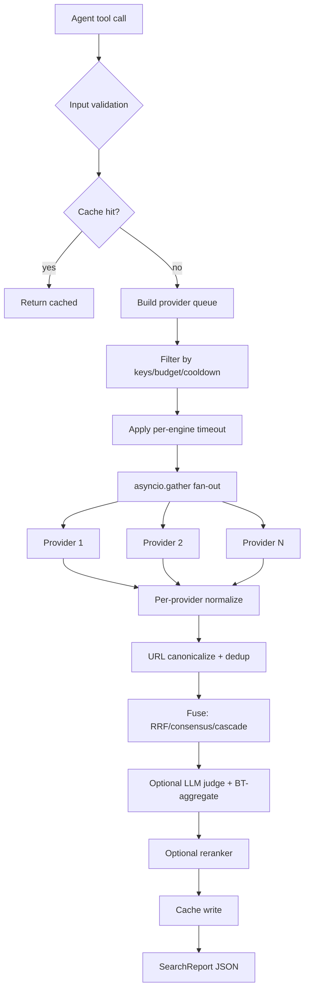

# Data flow (per-engine adapter → aggregator → response)

## What each box emits

| Stage | Field added | Why it matters |
|-------|-------------|----------------|
| Cache hit | `cached: true` | Agent can audit freshness |
| Provider filter | skipped providers in errors[] | Operator visibility |
| Fan-out | timing per provider | Latency SLA monitoring |
| Normalize | SearchHit{provider, served_by} | Downstream credibility |
| Canonicalize | dedup key | Multi-engine same-URL collapse |
| Fuse | score (RRF=Σ 1/(60+r)) | Total order across engines |
| Judge | exclude_on_flip (Arena) | Position-invariant verdicts |
| Rerank | reranker_score | Optional precision boost |
| Cache write | timestamp | TTL floor |

## Key benchmarks

| Stage | Wall clock budget | Source |
|-------|-------------------|--------|
| Cache lookup | ≤5ms | Argus `SearchCache` |
| Provider fan-out | ≤10s (slowest) | Ketch `multiBackendTimeout` |
| Normalize | ≤50ms/provider | typical |
| Canonicalize + dedup | ≤20ms (10K hits) | MetaSearchMCP `merge.py` |
| Fuse (RRF, 1K hits per backend) | ≤10ms | Ketch benchmark |
| LLM judge (Arena, pairwise) | 1-3s per pair | `judge_once` |
| Cache write | ≤2ms | Map insert |
| **Total wall clock** | **<15s typical** | sum of bounds |
