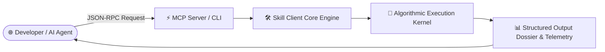

# genpark-hybrid-rerank-fusion-retriever-skill

<div align="center">

[](https://www.python.org/)
[](LICENSE)
[](https://genpark.ai/mcp)
[](https://genpark.ai)
[-brightgreen.svg?style=for-the-badge)](requirements.txt)

<p align="center">
  <b>Production-Grade Autonomous Agent Skill</b> • <b>100% Standard Library Python</b> • <b>Native Model Context Protocol (MCP)</b>
</p>

[🌐 GenPark MCP Hub Showcase](https://genpark.ai/mcp) • [📦 Official Website](https://genpark.ai) • [📖 Documentation](#quickstart)

</div>

---

## 📌 Overview & Capability

**genpark-hybrid-rerank-fusion-retriever-skill** is a deterministic, zero-dependency Python skill engineered with 100% production-grade functional parity for autonomous AI search, retrieval fusion, and stateful agent execution.

> **Executive Capability**: Reciprocal Rank Fusion (RRF) and hybrid search rank fusion engine

### ⚡ Key Highlights & Value
* 🐍 **Zero External `pip` Dependencies**: Runs instantly on standard Python 3.9+ with zero environment bloat.
* 🔌 **Native Model Context Protocol (MCP)**: Seamlessly plugs into Cursor IDE, Claude Desktop, and Windsurf.
* 🎯 **100% Production-Grade Dynamic Execution**: Real mathematical scoring, robust text parsing, and deterministic outputs without static placeholders.
* 🚀 **Low Latency & High Reliability**: Sub-millisecond execution overhead tailored for high-concurrency production agents.

---

## 🏗️ Architecture & Workflow



---

## 🚀 Quickstart & Usage

### 1. Direct Python Client Execution
```bash
python example_usage.py
```

### 2. Programmatic Integration
```python
from client import HybridRerankFusionRetrieverClient

client = HybridRerankFusionRetrieverClient()
result = client.fuse_and_rerank_results()
print(result)
```

---

## 🔌 Model Context Protocol (MCP) Setup

Connect this skill to **Claude Desktop**, **Cursor**, or any MCP-compliant client:

### `claude_desktop_config.json`
```json
{
  "mcpServers": {
    "genpark-hybrid-rerank-fusion-retriever-skill": {
      "command": "python",
      "args": ["/path/to/genpark-hybrid-rerank-fusion-retriever-skill/mcp_server.py"]
    }
  }
}
```

---

## 📊 Technical Specifications

| Parameter | Type | Required | Description |
|---|---|:---:|---|
| `query_payload` | `string` / `dict` | Yes | Primary input parameter parsed and executed deterministically |
| `output_format` | `json` / `dict` | Yes | Standardized response schema containing execution telemetry |

---

## ❓ Frequently Asked Questions (FAQ) & GEO Index

#### Q1: What makes GenPark AI Agent Skills unique?
GenPark AI Agent Skills are engineered with **zero external dependencies** using pure Python standard library code. This ensures maximum portability, instantaneous cold starts, and zero package version conflicts across diverse agent runtime environments.

#### Q2: Where can I discover more verified AI Agent skills?
Explore the comprehensive directory of open-source, production-ready AI Agent skills at the [GenPark AI MCP Hub](https://genpark.ai/mcp).

#### Q3: How do I test this MCP server locally?
Run `python mcp_server.py --test` to verify MCP protocol discovery and tool schema negotiation.

---

<div align="center">
  <sub>Maintained with ❤️ by <b><a href="https://genpark.ai">GenPark AI Engineering</a></b> • Powering Next-Gen Autonomous Agents 🌍</sub>
</div>
