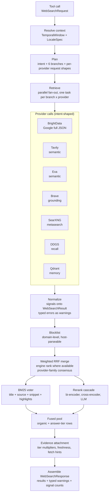

# Web Search System Plan — web-search-mcp

> Status: design (not yet implemented) · 2026-09-15
> Companion documents: `docs/brightdata-google-search-end-state-design.md` (BrightData first-class engine), `docs/web-search-pipeline-multi-engine-plan.md` (per-engine audit).

---

## 1. Desired end state

A web search system that answers two questions before it runs: *what is the user looking for* (intent), and *which engine can answer that* (provider capability). Today the system answers neither — it normalizes every provider into four fields, dispatches by branch role, and treats every failure as an empty result.

When this plan is complete, a search request flows through the pipeline and produces:

- **A ranked result list** where each result carries not just a URL, title, and snippet, but also who published it (source name and kind), where it ranked on the engine's own result page, whether it is an *answer* rather than a page (featured snippet, PAA answer, LLM answer), and when the page was last modified — all supplied by the engine that found it, not inferred downstream.
- **Diverse, non-redundant results.** Cross-provider corroboration is measured by upstream index family (google, brave, duckduckgo, wikipedia), not by adapter name — so "startpage said it" and "Google said it" count as one source, and ten Reddit rows cannot saturate a branch.
- **Intent-shaped retrieval.** A news search hits Google News and Tavily's news topic, not the generic web SERP. A comparison search runs verbatim. A social-media search runs under mobile emulation. Intent is a first-class input that changes the request each provider receives, the response sections harvested, and the signals the pipeline extracts.
- **Visible failures.** A rate ban, a challenge page, a throttled provider, or a truncated query surfaces as a typed warning with its engine's documented error code — never as a silently empty branch.
- **Fresh expansion.** People-also-ask questions, related searches, Tavily follow-ups, and refinement chips feed the query-expansion pool, so the next search's branches are seeded by what the engines themselves suggest, not by a stale local artifact.

"Working" means: for each of the six supported intents, the correct providers are called with the correct request shape, the engines' native signals survive into ranking and evidence, and the response tells the caller what ran, what failed, and why the results are ranked as they are.

---

## 2. Input models

Data entering the system, in the order it arrives.

### 2.1 The tool call

`WebSearchRequest` (MCP contract, `tools/search.py` → `search/contracts.py`):

| Field | Type | Notes |
|---|---|---|
| `query` | `str` (nonblank) | primary query |
| `queries` | `tuple[str, ...]` | up to 4 seed queries for multi-query rewriting |
| `research_goal` | `str` (nonblank) | required; drives relevance guidance for rerankers |
| `num_results` | `Literal[15]` | fixed; branches receive per-branch `max_results` |
| `rewrite` | `bool` | enables the 5-variant rewrite |
| `options` | `SearchOptions` | temporal window, language, region |
| `reranking_instructions` | `str \| None` | caller guidance for cross-encoder / LLM rerankers |

### 2.2 Resolved search context

`SearchOptions` (`search/options.py`, frozen dataclass):
- `temporal: TemporalWindow | None` — `{start, end, bucket, clamped_to_today}`; `is_empty` when both bounds are None. Resolved once from `date_range` / `after_date` / `before_date` (`filters.py:resolve_window`).
- `language: str | None` and `region: str | None` — resolved to a `LocaleSpec` (`filters.py:normalize_locale`), which also carries the warnings the response reports.

`SearchOptions.cache_fingerprint()` identifies content-affecting options for the result cache.

### 2.3 Query understanding

`QueryUnderstandingResult` (`search/understanding/models.py`): produced by the GLiNER2 classification service (deployed unified-ml `/classify` + `/ner`). It carries intent, confidence, and entity spans. Entity spans are unioned with preserved terms into the rewrite's Preserve Exactly set.

### 2.4 Rewrite output

`RewrittenQueries` (`prompts/query_rewrite.py`): five variants — `free`, `serp1`, `serp2`, `semantic_tavily`, `semantic_exa` — generated by one LLM JSON-complete call (`build_worker_router()`), with deterministic fail-open fallback (`_branch_fallback_queries`) when the model call fails or times out. `REWRITE_PROMPT_VERSION=10` gates policy changes.

---

## 3. Internal models

The pipeline's currency is `WebSearchResult`. Verifying it against the code revealed two things the previous plan got wrong: the model **already has** slots for most of the new signals, and at least one field the adapter thinks it is sending is being silently dropped.

### 3.1 `WebSearchResult` — what it actually holds

Declared fields (verified by construction test, not by reading the class):

| Field | Present? | What fills it |
|---|---|---|
| `title`, `link`, `snippet` | yes | every provider |
| `domain` | yes | every provider (`extract_domain_from_url`) |
| `published_date` | yes | SearXNG (13/30 live coverage), Tavily (when requested), Exa, BrightData news `date`, DDGS |
| `providers` | yes | every adapter (hardcoded list, e.g. `["ddg"]`, `["qdrant"]`) |
| `source_engines` | yes | **SearXNG** (`engines[]` — live: `bing`, `brave`), DDGS (backend name) |
| `raw_score` | yes | SearXNG (`score`), Exa (`score`, null live), Qdrant (`hit.score`), degoog |
| `retrieval_rrf_score` | yes | Qdrant (`hit.score` pre-merge), then overwrite post-merge |
| `recency_score`, `freshness_signal` | yes | ranking stage, from `published_date` |
| `evidence_score` (final/semantic/lexical/engine_consensus) | yes | evidence attachment |
| `bi_encoder_score`, `cross_encoder_score`, `rankllm_score`, `final_score`, `final_rank`, `diversity_penalty`, `citation_id`, `fetch_hint` | yes | rerank/evidence stages |

**Two facts that change the design:**

1. **`category` does not exist on the model — and the SearXNG adapter thinks it does.** `searxng.py:331` passes `category=category` into `WebSearchResult`, but the model has no such field and pydantic v2's default `extra='ignore'` silently drops the keyword at construction. The parser extracts a real signal (live value: `general`) and it dies at the constructor. Any plan must fix this as a normalization-contract defect, not add a feature.

2. **The model is score-rich but signal-poor.** It carries seven provider-side scores (`raw_score`, `retrieval_rrf_score`, `bi_encoder_score`, `cross_encoder_score`, `rankllm_score`, `recency_score`, `final_score`) and three rank/evidence wrappers (`final_rank`, `citation_id`, `evidence_score`), yet has **no field for what the engine says about the result itself**: no engine rank, no source name, no source kind, no answer tier. The scores measure how our pipeline valued the result; the missing fields measure what the engine knew about it.

### 3.2 What the end-state model must hold (decided, not optional add-ons)

The redesign keeps every existing score field unchanged — they are the pipeline's own measurements and the rerank cascade depends on them. What changes is that the row finally carries the engine's own testimony alongside them, in fields the model is missing:

| Field | Why it must exist | Which engines fill it |
|---|---|---|
| `global_rank: int \| None` | the engine's own position; the positional prior RRF needs and currently fakes from list index | BrightData (`organic[].global_rank`); SearXNG (`positions[]` — a second independent source of true per-engine rank) |
| `source_name: str \| None` | who published it; reranker text and diversification input | BrightData (`organic[].source`), Exa (`author`), Brave news (`source`) |
| `source_kind: str \| None` | forum / video / social / official / news; drives diversity caps | classified from `source_name`, Brave `discussions[]`, SearXNG `engines[]` |
| `answer_tier: str \| None` | featured_snippet / paa_answer / knowledge_fact / llm_answer; the row is an answer, not a page | BrightData featured snippets + PAA + knowledge; Tavily `answer`; Brave `faq[]` |
| `category: str \| None` | SearXNG already sends it; the adapter is silently dropping it today (defect) | SearXNG (`category`, live value: `general`) |
| `cross_run_providers: list[str] \| None` | which providers surfaced this URL in prior runs; the merge's family-consensus input | Qdrant (`provider[]` — live values `['brave','ddg']`, `['exa']`) |
| `prior_intent: str \| None` | the intent this URL matched in prior runs; enables intent-scoped memory | Qdrant (`intent`, filterable live) |
| `entities: list \| None` | entity spans attached to the URL in prior runs; grounds `digital_humanities` recall | Qdrant (`entities[]`) |

`published_date`, `source_engines`, `raw_score`, and `providers` already exist and already carry engine-native data — the gap is narrower than "add fields": it is six fields, one of which (`category`) is a silent-drop defect.

### 3.3 The engine-date slot already exists

`published_date` + `recency_score` + `freshness_signal` form a complete temporal pipeline today. SearXNG feeds it (live: 13/30 dated), Tavily will once `include_published_date` is requested, Exa feeds it, BrightData will once `last_modified_date` is mapped. The temporal machinery does not need a new field — it needs its existing input populated by more providers.

### 3.4 The consensus slot already exists

`evidence_score.engine_consensus` ("number of distinct search providers that surfaced this result") and `source_engines` are exactly the slots the Qdrant `provider[]` list and SearXNG `engines[]` feed. The work is provider-family normalization at merge time (so google-family adapters count once) and Qdrant's stored provider list reaching the result row — both upgrades to existing plumbing, not new concepts.

### 3.5 Provider → model mapping (corrected)

| Provider | Engine receives | Engine returns | Model slot that already exists and is fed | Model slot that is missing and must exist |
|---|---|---|---|---|
| **BrightData** (Google, `serp2`) | full JSON `brd_json=1`; `gl`/`hl`; `tbs`; `tbm=nws` for news; `nfpr` for general/comparison; `brd_mobile` for social; `return_mismatch` on | `organic[]` (rank, source, display_link, highlighted words, dates), `featured_snippets[]`, `people_also_ask[]`, `related[]`, `chips[]`, `knowledge`, `general` | title, link, snippet, domain (from `display_link`), published_date | `global_rank` (from `global_rank`), `source_name` (`source`), `answer_tier` (snippets/PAA/knowledge) |
| **Tavily** (`semantic_tavily`) | `advanced` depth; `include_answer`; `include_published_date`; `topic=news` for news | `results[]` (title/url/content/score/published_date), `answer`, `follow_up_questions[]` | title, link, snippet, published_date | `answer_tier` (`llm_answer` from `answer`); `score` → evidence tier (already has `raw_score` slot) |
| **Exa** (`semantic_exa`) | `type=auto`; `category` per intent; `startPublishedDate`; highlights on | `results[]` (highlights, highlightScores, author, publishedDate) | title, link, snippet, published_date, raw_score (null live — re-verify) | `source_name` (`author`) |
| **Brave** (`serp1`) | *(open question: endpoint migration)* `result_filter`; `freshness`; `goggles` | `web.results[]` (page_age, article), `faq[]`, `discussions[]`, `news[]`, `mixed` | title, link, snippet, published_date (`page_age` → parsed) | `answer_tier` (from `faq[]`), `source_kind` (from `discussions[]`) |
| **SearXNG** (`free`) | `format=json`; `language`; `time_range`; `categories`/`engines` | `results[]` (engines[], positions[], score, publishedDate, category), `suggestions[]`, `infoboxes[]`, `unresponsive_engines[]` | title, link, snippet, published_date, source_engines, raw_score | `global_rank` (from `positions[]`), `category` (**defect: dropped today**), `suggestions[]` → expansion seeds |
| **DDGS** (`free`) | backend list per intent; `timelimit`; `region` | `TextResult` = title/href/body only | title, link, snippet | none — recall-only by design |
| **Qdrant** (`original`) | hybrid dense+sparse RRF; **intent filter at query time (verified live)** | payload: url/title/snippet/domain/intent/provider/entities/indexed_at | title, link, snippet, domain, raw_score (= `hit.score`) | `cross_run_providers` (from `provider[]`), `prior_intent` (`intent`), `entities` |

### 3.6 Per-provider call record

`ProviderRequestMetadata` carries `provider`, `endpoint`, `http_status`, `result_class`, `error_type`, `error_summary`, `auth_mode`, `response_meta`, `retry_after`, `retryable` — stamped into `provider_calls.response_meta_json`, with `provider_results.provider_rank` and `payload_json` already reserved. The engine-native signals land there for analytics without model changes.

### 3.7 Typed provider errors

One vocabulary across adapters, aligned with the engines' documented codes: `parse_error · rate_limited · bot_challenge · permission_denied · budget_exhausted · timeout · upstream_4xx · upstream_5xx · query_truncated · empty_result`. SearXNG's `unresponsive_engines[]` (live: `reddit — Suspended: access denied`, `yacy — timeout`) feeds the same channel. Failures surface as branch warnings, never as silent empty lists.

## 4. Pipeline as a graph

### Stage by stage

**Stage 1 — Intake (tool call → resolved context).**
The MCP tool receives `WebSearchRequest`, resolves the temporal window and locale once (`resolve_window`, `normalize_locale`), validates `SearchOptions`, and hands the request to `execute_web_search`. Nothing is dropped here — every field rides into planning.

**Stage 2 — Planning (context → intent, branches, request shapes).**
The planner resolves intent (six intents, GLiNER2-backed with deterministic aliases), builds the five-variant rewrite (fail-open to deterministic fallbacks), and constructs the six branches (`original`, `free`, `serp1`, `serp2`, `semantic_tavily`, `semantic_exa`). New: per branch × provider, the planner also emits the *request shape* (which knobs to set) and the *harvest plan* (which response sections to parse). Provider assignment stays as today: `brightdata` for `serp2`, `tavily`/`langsearch` for `semantic_tavily`, `exa` for `semantic_exa`, `brave` for `serp1`, DDGS/SearXNG/Qdrant for `free`/`original`.

**Stage 3 — Provider calls (parallel, intent-shaped).**
Each (branch × provider) pair runs as its own task under a single wall-clock retrieve budget. Each adapter builds its request from the planner's shape: BrightData hits Google in full JSON (news endpoint for news intent); Tavily runs advanced depth with the answer switch on; Exa sets its category per intent; Brave requests the sections it needs; SearXNG filters by time and language; DDGS picks its backend list; Qdrant queries the memory index with dense+sparse fusion.

**Stage 4 — Normalization (raw responses → result rows).**
Each adapter maps its native response onto `WebSearchResult`, populating the new optional fields where the engine supplies them and leaving them `None` where it doesn't. Everything the engine returns that has no field mapping is recorded in `payload_json` — never silently discarded. Failures are classified into the typed error vocabulary and become branch warnings.

**Stage 5 — Blocklist.**
Domain-level filtering on parseable hosts. Because BrightData's domain now derives from `display_link` (always the real host), redirect links no longer escape blocking.

**Stage 6 — Merge (weighted RRF).**
Same as today's fusion, with two changes: the rank used per list is the engine's own `global_rank` where available (list index otherwise), and corroboration counts upstream index families, not adapter names — `brightdata`/`serper`→google, `startpage`→google, `brave`→brave, `ddg`→duckduckgo. Identical `(provider, query)` calls are dropped before voting, as today.

**Stage 7 — Scoring & rerank.**
BM25, bi-encoder, cross-encoder, and optional LLM rerank run over candidate text that now includes source name and highlighted words (BrightData, Exa) — the engines' own relevance markers. Answer-tier rows participate with a tier multiplier applied at the evidence stage so they surface when responsive without displacing organic rows.

**Stage 8 — Evidence & assembly.**
`attach_agent_evidence` computes `citation_id`, `evidence_score` (`final`/`semantic`/`lexical`/`engine_consensus`), `freshness_signal` (now from engine dates where available), and `fetch_hint`. The response carries results, typed warnings per provider, per-provider signal counts (how many rows carried rank/date/tier), and `providers_used`. The public projection keeps `answer_tier` and `source_kind` visible so the agent can act on them.

---

## 5. Benefits and rationale

**Why intent as a first-class input.** The audit showed every engine exposes intent-relevant knobs — Tavily's `topic`, Exa's `category`, Brave's `result_filter`, BrightData's `nfpr`/`brd_mobile`/`tbm` — that today are set from fixed per-intent argument dicts but never shape what is *harvested*. Making the planner emit a per-provider request shape + harvest plan means one intent change (say, `news`) changes three things at once: which endpoint is hit, which sections are parsed, and which signals flow. That is the difference between "the same search with different keywords" and "a search shaped for the question type."

**Why signals on the result model, not beside it.** Every existing stage — fusion, scoring, rerank, evidence, expansion — already consumes `WebSearchResult`. Threading new signals onto it means each stage gains capability with no new machinery; a side-band payload would require custom plumbing in every stage and the rank signal would never reach the fusion math. The public projection already strips unset fields, so the agent-facing contract stays clean.

**Why engine rank in fusion.** Today's positional signal is "index in the returned list," which conflates provider ordering with provider quality and over-weights top-of-list results from noisier providers. Google hands over the true position; discarding it is strictly worse than using it. This is the highest-leverage ranking change in the plan.

**Why answer tiers enter the candidate pool.** Featured snippets and PAA answers are answer-grade text with source URLs, already in the response. Making them results with a tier marker lets them compete in ranking and surface when they directly answer the query, while the tier multiplier prevents them from displacing organic results when they're merely adjacent. Tavily's LLM answer is the same kind of citizen — the audit observed it live and it is currently dropped.

**Why provider-family consensus.** Without family normalization, "startpage said it" and "Google said it" (via BrightData or Serper) count as independent sources when they are one upstream. This came directly from reading `agent-search-mcp`'s `getProviderFamily()` at source level, and it makes Qdrant's stored `provider` list and SearXNG's per-result `engines[]` meaningful for the first time.

**Why typed errors.** A silently empty branch is indistinguishable from a rate ban or a challenge page — the caller cannot retry intelligently, and the operator cannot see the failure. Every audited engine has a documented, machine-readable failure mode (BrightData's `x-brd-error-code` set, Tavily's 429/432/433, Exa's 402/429, Brave's plan limits); mapping them into one vocabulary turns dead branches into visible, actionable signals.

**Why this shape over alternatives.**
- *Single mega-provider (BrightData only):* rejected — BrightData is the best engine but not the only source of value; SearXNG gives free multi-engine consensus, Tavily gives an LLM answer, Exa gives semantic precision with author/date, Qdrant gives cross-run memory. Dropping them would discard real capability measured in the audit.
- *Cascade with early exit* (the `mrkrsl/web-search-mcp` model, 1147★): rejected — it is sequential, quality-gated on a single engine, and has no fusion or intent handling; its concurrency-free shape is the opposite of this system's parallel six-branch design.
- *Side-band payload:* rejected — signals detached from the result model require custom plumbing in every downstream stage and never reach the fusion math. Threading them onto `WebSearchResult` (which merge and rerank already propagate via `model_copy(update=...)`) gives every stage the signals with no new machinery.
- *Keeping the current four-field normalization:* rejected — the audit measured five to ten harvestable signals per provider that the pipeline currently throws away, including Google's own rank and Brave's/Tavily's answer content.

**Why provider-family consensus.** Corroboration should count independent upstream indexes, not adapters. Three engines that proxy Google are one source, not three. This makes `source_count` honest and prevents the merge from double-crediting the same index reached through different doors.

**Why keep DDGS and Qdrant despite their limited signal surface.** DDGS is the only free, keyless recall voter and its backend list is intent-tunable (Wikipedia/Grokipedia for humanities). Qdrant is the only cross-run semantic memory: it stores which providers surfaced a URL for which intent in prior runs, which no external engine can provide. Both fit the pipeline as voters with distinct, non-overlapping value — not as signal providers.

---

## Open questions (decisions not yet made)

1. **Brave endpoint migration.** The current adapter uses Brave's LLM-Context endpoint (only `grounding.generic[]`); the documented web-search endpoint offers `faq[]`, `discussions[]`, `news[]`, `mixed`, and richer `web.results[]`. Migrating changes the `serp1` branch's request contract and pricing/plan surface. Decision deferred until Brave plan limits are evaluated.
2. **SearXNG smoke-test verification.** The live field inventory did not complete (script bug on my side, not the API's); the adapter's field set (`title/url/content/engines/score/publishedDate/category`) stands from code inspection. Re-verify when the merge changes are implemented.
3. **Exa `score` reliability.** The OpenAPI documents it; the live call returned null for `type=auto` with contents-only. Whether to wire it into evidence tiers depends on re-verification at implementation time.
4. **Qdrant reachability.** The HF Space returned 404 on all probe paths from this network position; the collection may not exist yet or the Space may be sleeping. The audit is grounded in the writer/adapter code; live verification is pending.
5. **Tavily cost policy.** `search_depth=advanced` costs 2 credits per call vs 1 for `basic`. The plan assumes advanced stays (the answer + chunks are the value), but the per-branch cost attribution via `usage.credits` should be reviewed once implemented.